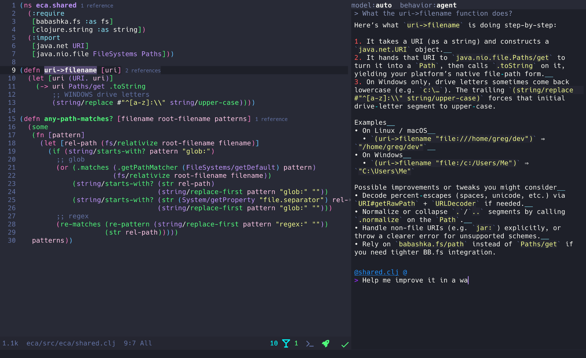

[](./LICENSE)

# ECA (Editor Code Assistant)

:warning: The project is still alpha and experimental, with bugs and missing features, but being consistently improved.

_Demo using [eca-emacs](https://github.com/editor-code-assistant/eca-emacs)_


## Rationale 


An OpenSource editor agnostic tool that aims to easily link LLMs <-> Editors, giving the best UX possible for AI pair programming using a well-defined protocol.

- **Editor-agnostic** protocol for any editor integrate.
- **Chat** interface: ask questions, review diffs, work together with an agent in your codebase.
- **AI-powered completions**, docs & refactorings.
- **Streaming responses** and structured error handling.
- **Pluggable models**: Ollama local models, OpenAI, Anthropic, more on the way.
- **Single configuration**: Configure eca behavior making it feel the same in any editor.

## Installation

Stable release:

```bash
sudo bash <(curl -s https://raw.githubusercontent.com/editor-code-assistant/eca/master/install)
```

nightly build:

```bash
sudo bash <(curl -s https://raw.githubusercontent.com/editor-code-assistant/eca/master/install) --version nightly
```

## Usage

Editors should spawn server via `eca server` and communicate via stdin/stdout.

## Configuration

Check all available configs [here](./src/eca/config.clj#L15).
There are 3 ways to configure ECA following following this order of priority:

### InitializationOptions (convenient for editors)

Client editors can pass custom settings when sending the `initialize` request via the `initializationOptions` object:

```javascript
"initializationOptions": {
  "chat_behavior": "chat"
}
```

### Config file (conveninent for users)

`.eca/config.json`

```javascript
{
  "chat_behavior": "chat"
}
```

### Env Var

Via env var during server process spawn:

```bash
ECA_CONFIG='{"my_config": "my_value"}' eca server
```

## Rules

Rules are contexts that are passed to the LLM during a prompt.
There are 2 possible ways following this order of priority:

### Project file

A `.eca/rules` folder from the workspace root containing `.md` files with the rules.

`.eca/rules/talk_funny.md`
```markdown
--- 
name: Funny rule
---

- Talk funny like Mickey!
```

### Config 

Just add to your config the `:rules` pointing to md files that will be searched from the workspace root if not an absolute path:

```javascript
{
  "rules": [{"path": "my-rule.md"}]
}
```

## Supported editors

- [Emacs](https://github.com/editor-code-assistant/eca-emacs)
- [VsCode](https://github.com/editor-code-assistant/eca-vscode): WIP
- Intellij: Planned
- Vim: Planned, help welcome

## Protocol

The protocol can be found [here](./docs/protocol.md), it follows the same standard of LSP documentation, defining how server and client communicate with each other.

## Roadmap

- Centralize roadmap in a Github Project.
- Error handling
- Support more editors: VScode, IntelliJ and Vim.
- Rules configuration
- Improve docs splitting readme in different doc pages.
- Support more model options like thinking, reasioning.
- Improve context passed to LLM, creating a repo map or translating to embedded vectors.
- Support more models.
- Support MCP configuration.
- Code completion using AI.
- Edit/fix me support using AI.

## Contributing

Contributions are very welcome, please open a issue for discussion or pull request.
