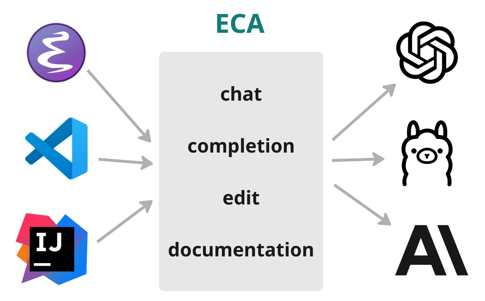

# ECA (Editor Code Assistant)

_Demo using [eca-emacs](https://github.com/editor-code-assistant/eca-emacs)_

_Demo using [eca-vscode](https://github.com/editor-code-assistant/eca-vscode)_

  <a href="./docs/installation.md"><strong>installation</strong></a> •
  <a href="./docs/features.md"><strong>features</strong></a> •
  <a href="./docs/configuration.md"><strong>configuration</strong></a> •
  <a href="./docs/models.md"><strong>models</strong></a> •
  <a href="./docs/protocol.md"><strong>protocol</strong></a>

- :page_facing_up: **Editor-agnostic**: protocol for any editor to integrate.
- :gear: **Single configuration**: Configure eca making it work the same in any editor via global or local configs.
- :loop: **Chat** interface: ask questions, review code, work together to code.
- :coffee: **Agentic**: let LLM work as an agent with its native tools and MCPs you can configure.
- :syringe: **Context**: support: giving more details about your code to the LLM.
- :rocket: **Multi models**: OpenAI, Anthropic, Ollama local models, and custom user config models.

## Rationale 

A Free and OpenSource editor-agnostic tool that aims to easily link LLMs <-> Editors, giving the best UX possible for AI pair programming using a well-defined protocol. The server is written in Clojure and heavily inspired by the [LSP protocol](https://microsoft.github.io/language-server-protocol/) which is a success case for this kind of integration.

The protocol makes easier for other editors integrate and having a server in the middle helps adding more features quickly like exporting metrics of features usage or single way to configure it for any editor.

## Getting started

Install the plugin for your editor and ECA server will be downloaded and started automatically.

### Supported editors

- [Emacs](https://github.com/editor-code-assistant/eca-emacs)
- [VsCode](https://github.com/editor-code-assistant/eca-vscode)
- [Vim](https://github.com/editor-code-assistant/eca-nvim)
- Intellij: Planned, help welcome

## How it works

Editors spawn the server via `eca server` and communicate via stdin/stdout. Logs are printed to stderr, use `--verbose` to log client<->server communication or `--log-level debug`  to log more info like LLM responses.

Supported editors already download latest server on start and require no extra configuration

## Roadmap

Check the planned work [here](https://github.com/orgs/editor-code-assistant/projects/1/views/1).

## Troubleshooting

You can start eca with `--log-level debug` which should log helpful information in stderr buffer like what is being sent to LLMs.

## Contributing

Contributions are very welcome, please open an issue for discussion or a pull request.
For developer details, check [this doc](./docs/development.md).

## Support the project 💖

Consider [sponsoring the project](https://github.com/sponsors/ericdallo) to help grow faster, the support helps to keep the project going, being updated and maintained!
