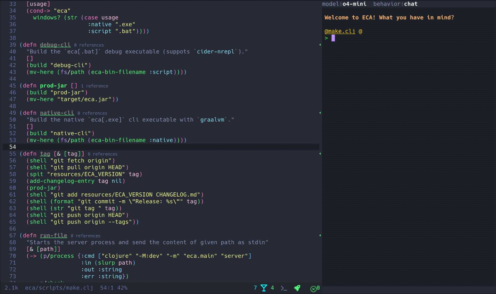

[](./LICENSE)

# ECA (Editor Code Assistant)

:warning: The project is still alpha and experimental, with bugs and missing features, but being consistently improved.

_Demo using [eca-emacs](https://github.com/editor-code-assistant/eca-emacs)_


## Rationale 


A Free and OpenSource editor-agnostic tool that aims to easily link LLMs <-> Editors, giving the best UX possible for AI pair programming using a well-defined protocol. The server is written in Clojure and heavily inspired by the [LSP protocol](https://microsoft.github.io/language-server-protocol/) which is a success case for this kind of integration.

- **Editor-agnostic** protocol for any editor to integrate.
- **Single configuration**: Configure eca making it work the same in any editor.
- **Chat** interface: ask questions, review diffs, work together with an agent in your codebase.
- **Context** support: giving more details about your code to the LLM.
- **Pluggable models**: Ollama local models, OpenAI, Anthropic, more on the way.

## Installation

Eca is written in Clojure and compiled into a native binary via graalvm. You can download the binaries from Github Releases or use the install script for convenience:

Stable release:

```bash
bash <(curl -s https://raw.githubusercontent.com/editor-code-assistant/eca/master/install)
```

nightly build:

```bash
bash <(curl -s https://raw.githubusercontent.com/editor-code-assistant/eca/master/install) --version nightly
```

## Usage

Editors should spawn the server via `eca server` and communicate via stdin/stdout.

## Configuration

Check all available configs [here](./src/eca/config.clj#L15).
There are 3 ways to configure ECA following this order of priority:

### InitializationOptions (convenient for editors)

Client editors can pass custom settings when sending the `initialize` request via the `initializationOptions` object:

```javascript
"initializationOptions": {
  "chat_behavior": "chat"
}
```

### Config file (convenient for users)

`.eca/config.json`

```javascript
{
  "chat_behavior": "chat"
}
```

### Env Var

Via env var during server process spawn:

```bash
ECA_CONFIG='{"my_config": "my_value"}' eca server
```

## Rules

Rules are contexts that are passed to the LLM during a prompt.
There are 2 possible ways following this order of priority:

### Project file

A `.eca/rules` folder from the workspace root containing `.md` files with the rules.

`.eca/rules/talk_funny.md`
```markdown
--- 
name: Funny rule
---

- Talk funny like Mickey!
```

### Config 

Just add to your config the `:rules` pointing to `.md` files that will be searched from the workspace root if not an absolute path:

```javascript
{
  "rules": [{"path": "my-rule.md"}]
}
```

## Supported editors

- [Emacs](https://github.com/editor-code-assistant/eca-emacs)
- [VsCode](https://github.com/editor-code-assistant/eca-vscode): WIP
- Intellij: Planned
- Vim: Planned, help welcome

## Protocol

The protocol can be found [here](./docs/protocol.md), it follows the same standard of LSP documentation, defining how server and client communicate with each other.

## Roadmap

Check the planned work [here](https://github.com/orgs/editor-code-assistant/projects/1/views/1).

## Contributing

Contributions are very welcome, please open an issue for discussion or a pull request.
For developer details, check [this doc](./docs/development.md).
